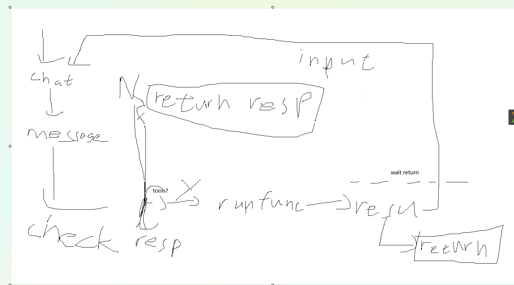
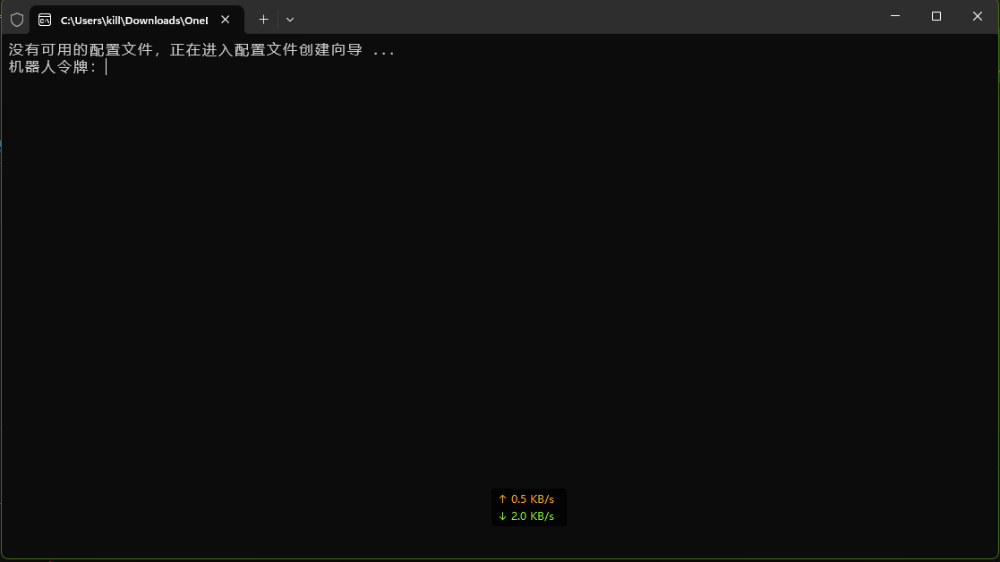
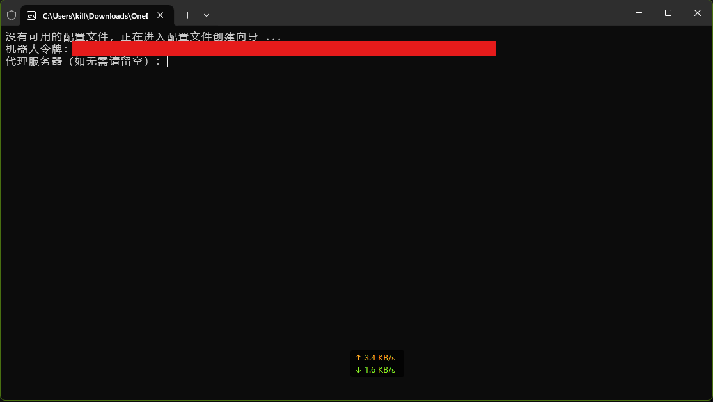
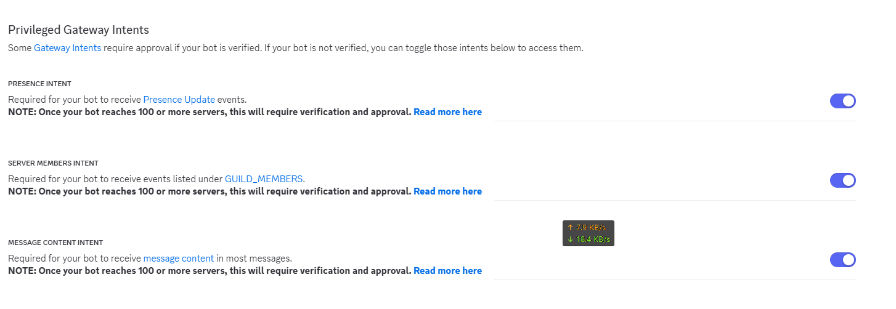
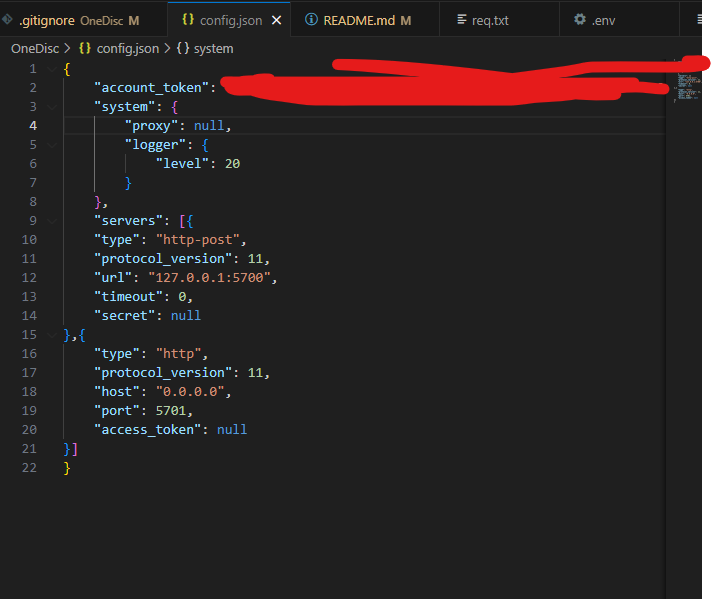

# ONEBOT_AI_BOT  
using ONEBOT V11   
using MC-Server-Info(https://github.com/Spark-Code-China/MC-Server-Info/)  
using hires-fix(https://github.com/xinntao/Real-ESRGAN)  
# ---- How to use ---  
run:git clone https://github.com/1qa2ws3ed4rf1/SL_QQ_BOT.git  
open .env and goto '.env' part [click here](##-.env:)  
run:install.ps1  
run:python main.py  
startuping  
## commands:  
`cx` or `/server`:get servers online players(btw cx means '查询',inquire in chinese) can config to get mc server:)
`/ai `:run ai chat  
`/config `:config this
# config:  
## config.json:
open [config.json](config.json)
```
{
        "network": {
        "ws":{
            "enable": false,
            "url": "ws://"
        },
        "http": {
            "t": {
                "ip": "http://127.0.0.1",
                "port": "5700"
            },
            "f": {
                "ip": "127.0.0.1",
                "port": "5701"
            }
        }
    },
    "admin":[],
    "secert":{
        "fht":"",
        "aikey":"",
        "local_model_login_token":""
    },
    "maxtokens":"",
    "lang":"zh",
    "allow_ai_draw":true,
    "allow_ai_sound": false,
    "local":{
        "model":""
    },
    "online":{
        "aiurl":"",
        "model":""
    },
    "group":{
        "0":{
            "ai":true,
            "cx->mc":false,
            "mc_ip":"",
            "sl_pb":["YyMi7aUL","Q6u5vvmP"],
            "tdwf":{
                "en":false,
                "one2":1,
                "atwf":true
            }
        }
    }
}
```
```
network_t:  
    ip=onebot Post to ip   
    port= onebot post to port  
network_f:  
    ip=onebot Post from ip  
    port= onebot post from port  
ws:   
    enable=enable websocket
    url=websocket server url(this program is client)
network_f:  
    ip=onebot Post from ip  
    port= onebot post from port  

maxtokens=ai gen max tokens  
admin=admin(you need input their id)  
online:  
aiurl=api url  
model=calling model  
secert:  
"fht"= hefeng weather api key  
"aikey":ai token key   
"local_model_login_token": hf token  
when you want ai can draw,change config.json `"allow_ai_draw":false` to `"allow_ai_draw":true` 
"allow_ai_sound": allow ai send sound record(ONLY TEST ON QWEN-OMNI)
group:  
0:default config  
tdwf:useless  
sl_pb:your sl servers pastebin  
"mc_ip":your mc ip  
cx->mc:false = sl true = mc  
```
## program: 
### ai draw: 
when you want ai can draw,change config.json `"allow_ai_draw":false` to `"allow_ai_draw":true` 
### ai on gpu:  
WARN tools ARE NEED YOUR MODEL SUPPORT AND CODE SUPPORT(WRITE BY YOU OR USE OUR DEMO [demo](aiONGPU-tools-demo.py) )   
mostly like   
open [main.py](main.py)  
change  `from ai import chat` to `from aiONGPU import chat`  
# --- where is onebot clent? ---  
## qq:
idk dont ask me,ask tencent  
## discord:https://github.com/ITCraftDevelopmentTeam/OneDisc/ (install by you guys)  
step 1: when  input your bot token  
step 2: when  input your proxy ip or null    
step 3: config your file  [click here](###-CONFIG(using-https://onedisc.itcdt.top/config.html))
### CONFIG(using https://onedisc.itcdt.top/config.html):  
config file will create in the directory of the executable dir:

More important configurations(Translate using bing):  
Can I send voice (`can_send_record`)  
type:Boolean Must there:No default value:false  
can_send_record (OneBot V11) interface in the yes field  

Escaping MarkDown(escape_markdown) in the text section  
Type must be the default  
Boolean No false  
  
Number of download retries (`download_max_retry_count`)  
Type Number Must:No default value:0  
upload_file The number of retries in case of download errors and related   actions  
  
Whether to ignore self-events (`ignore_self_events`)  
The type Boolean must have a default value of no true  
If true, events triggered by the bot itself will be ignored  

Strike allowed (`allow_strike`)(WHAT)  
The type Boolean must be No default value false  
If true, there is a 10% chance that a 36000 (I am tired) error will be   returned each time an action is executed(?)  
### CONNECT CONFIG MOST IMPORTANT:  
 (new update:Presence Intent can off)  
paste this in to '"servers": []'  
```
"servers": [{  
    "type": "http-post",  
    "protocol_version": 11,  
    "url": your fip+fport(like 127.0.0.1:5700),  
    "timeout": 0,   
    "secret": null   
},{  
    "type": "http",  
    "protocol_version": 11,  
    "host": your tport(like 5701),  
    "port": your tip(like 0.0.0.0),  
    "access_token": null  
}]
```
like be:  
  
todo:tdwf
