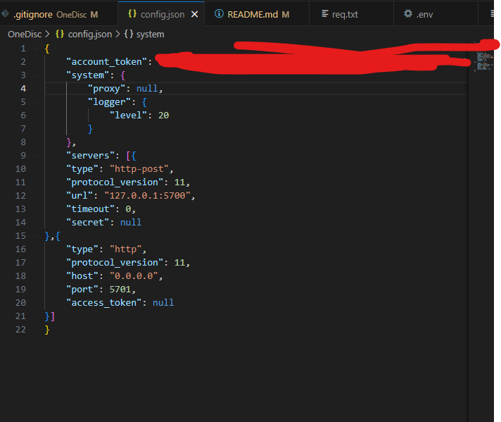
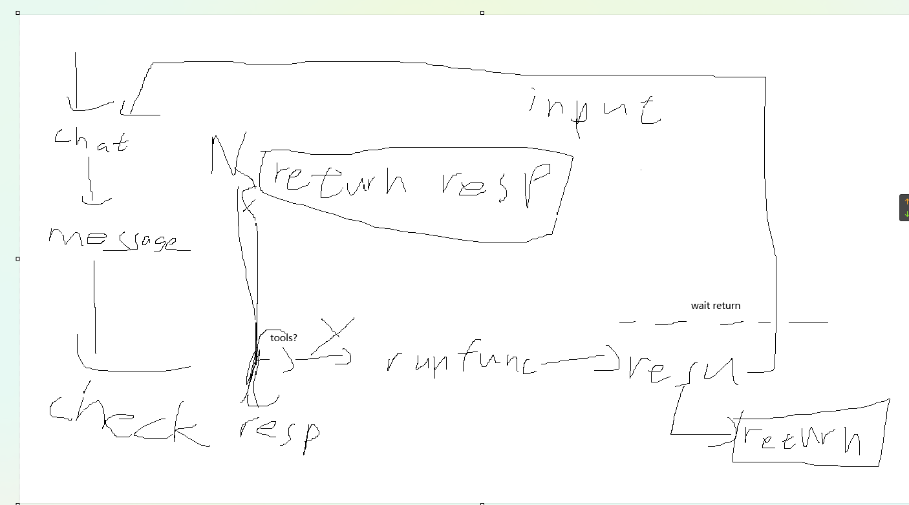
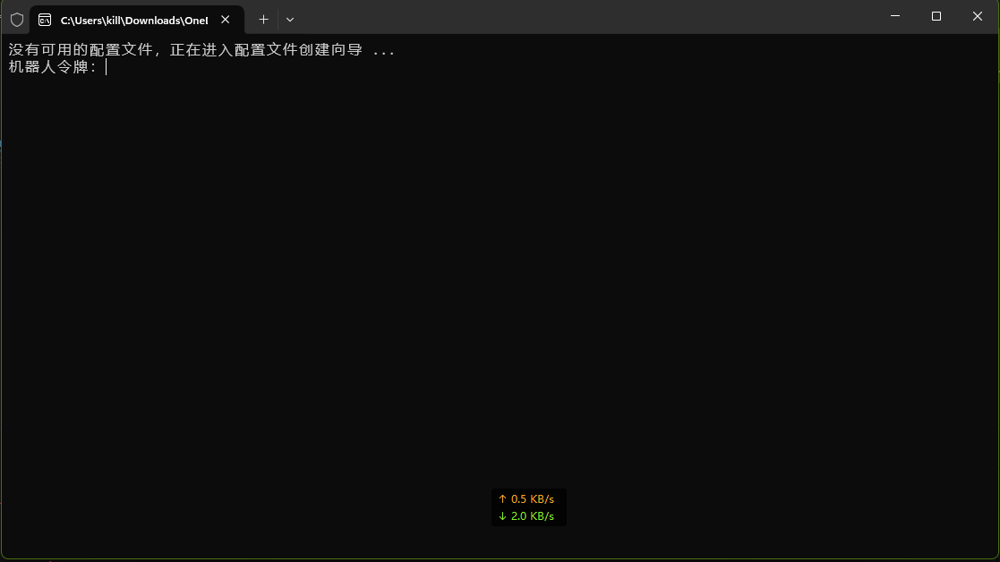
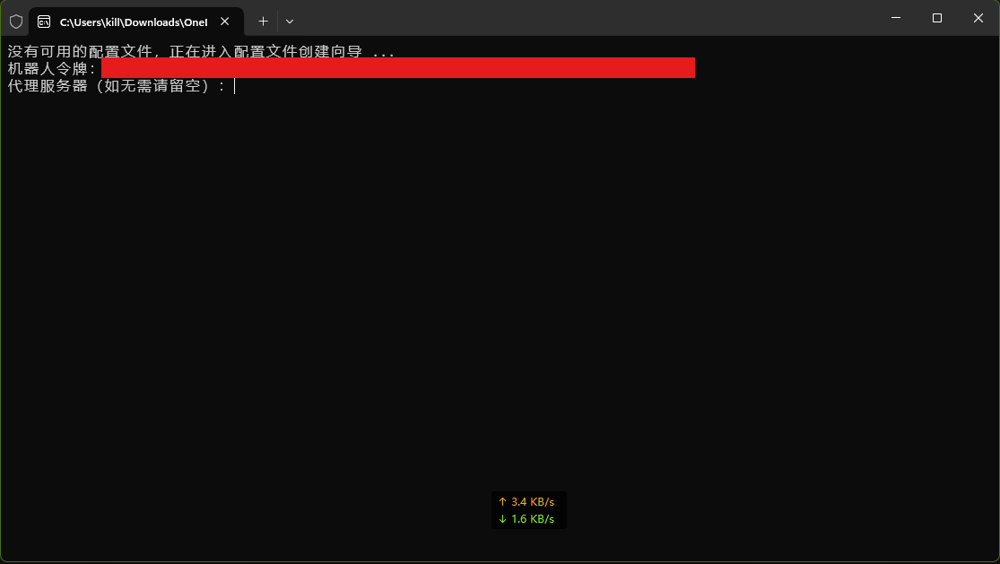
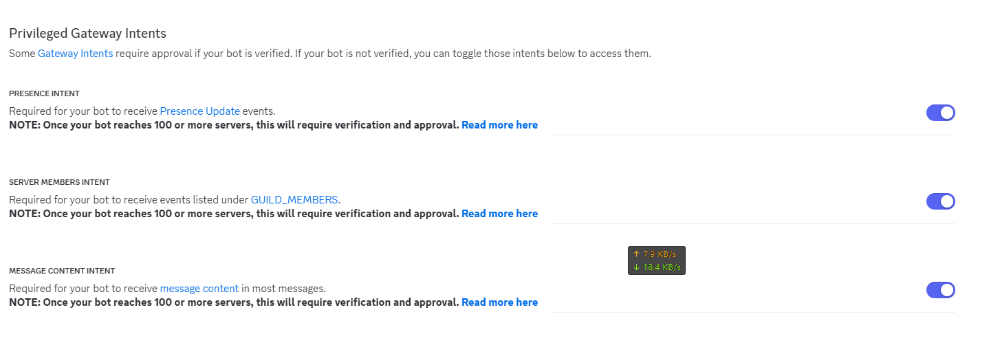

# ONEBOT_AI_BOT  
using ONEBOT V11   
using MC-Server-Info(https://github.com/Spark-Code-China/MC-Server-Info/)  
using hires-fix(https://github.com/xinntao/Real-ESRGAN)  
# ---- How to use ---  
run:git clone https://github.com/1qa2ws3ed4rf1/SL_QQ_BOT.git  
open .env and goto '.env' part [click here](##-.env:)  
run:install.ps1  
run:python main.py  
startuping  
## commands:  
cx or /server:get servers online players(btw cx means '查询',inquire in chinese)
# config:  
## .env:
open [.env ](.env)   
```
aikey=  
fht = ''  
fip='0.0.0.0'   
tip='127.0.0.1'  
fport= '5700'   
tport= '5701'   
aiurl = ''  
model = ''  
Gmodel_maxtokens = 1000
Gmodel = '' 
Gmodel_login_token = ''
lang = ''
cx_mc = ["0","0"]
mc_ip = ''
mc_port = ''
sl_pb = ["YyMi7aUL","Q6u5vvmP"]
```
aikey=open ai api key  
fht = 和风天气api key waiting for rewrite  
fip=onebot Post from ip  
tip=onebot Post to ip  
fport= onebot post from port  
tport= onebot post to port  
aiurl = openai base url  
model = openai model choose  
Gmodel_maxtokens = On local model/online model max Token  
Gmodel = hugging face model url    
Gmodel_login_token = 'hf_?' if model need your login token,input there  
lang = languange support weather(unfin) prompt(->[`lang`](lang)+`\prompt_`+lang+`.txt` like:lang\prompt_zh.txt)  
cx_mc = group of using MC-Server-Info(not sl server) write like `["group1","group2"]`  
sl_pb = your pastebin of sl server write like `["pb1","pb2"]` (btw 'YyMi7aUL','Q6u5vvmP' is my favorite sl server:)  
## program: 
### ai draw: 
open [ai.py](ai.py)  
when you want ai can draw,change `draw = False` to `draw = True`  
### ai on gpu:  
WARN tools ARE NEED YOUR MODEL SUPPORT AND CODE SUPPORT(WRITE BY YOU OR USE OUR DEMO [demo](aiONGPU-tools-demo.py) )   
mostly like   
open [main.py](main.py)  
change  `from ai import chat` to `from aiONGPU import chat`  
# --- where is onebot clent? ---  
## qq:
idk dont ask me,ask tencent  
## discord:https://github.com/ITCraftDevelopmentTeam/OneDisc/ (install by you guys)  
step 1: when  input your bot token  
step 2: when  input your proxy ip or null    
step 3: config your file  [click here](###-CONFIG(using-https://onedisc.itcdt.top/config.html))
### CONFIG(using https://onedisc.itcdt.top/config.html):  
config file will create in the directory of the executable dir:

More important configurations(Translate using bing):  
Can I send voice (`can_send_record`)  
type:Boolean Must there:No default value:false  
can_send_record (OneBot V11) interface in the yes field  

Escaping MarkDown(escape_markdown) in the text section  
Type must be the default  
Boolean No false  
  
Number of download retries (`download_max_retry_count`)  
Type Number Must:No default value:0  
upload_file The number of retries in case of download errors and related   actions  
  
Whether to ignore self-events (`ignore_self_events`)  
The type Boolean must have a default value of no true  
If true, events triggered by the bot itself will be ignored  

Strike allowed (`allow_strike`)(WHAT)  
The type Boolean must be No default value false  
If true, there is a 10% chance that a 36000 (I am tired) error will be   returned each time an action is executed(?)  
### CONNECT CONFIG MOST IMPORTANT:  
 (new update:Presence Intent can off)  
paste this in to '"servers": []'  
```
"servers": [{  
    "type": "http-post",  
    "protocol_version": 11,  
    "url": your fip+fport(like 127.0.0.1:5700),  
    "timeout": 0,   
    "secret": null   
},{  
    "type": "http",  
    "protocol_version": 11,  
    "host": your tport(like 5701),  
    "port": your tip(like 0.0.0.0),  
    "access_token": null  
}]
```
like be:  
todo:more lang supports,wea rewrite
